<!-- Animated Header -->

 

<!-- Logo Animation -->

 

<!-- Tagline -->

  

<!-- Stats Badges -->

  

---

 

## 🏛️ About NAWALA

**NAWALA** (नवल) means "New" or "Novel" in Sanskrit. We build modern, secure, and elegant infrastructure solutions inspired by ancient wisdom.

Our mission is to create **enterprise-grade open source platforms** that prioritize:

| 🔒 **Security First** | ⚡ **Performance** | 🎨 **Beautiful Design** | 🌐 **Open Source** |
|:---:|:---:|:---:|:---:|
| Military-grade encryption | Optimized for speed | Intuitive UX/UI | Community-driven |

 

---

 

## 🚀 Our Projects

<!-- Project Cards -->
<table>
<tr>
<td align="center" width="33%">

### 💻 Sanchala OS

**Beautiful & Secure Linux Distribution**

A privacy-focused OS with macOS-inspired UI,
8-layer security architecture, based on Arch Linux + KDE Plasma 6.

 

[🔗 Repository](https://github.com/nawala-team/sanchala-os)

</td>
<td align="center" width="33%">

### 🔐 Nawala Gateway

**Secure API Gateway Platform**

Enterprise WAF, OAuth2/JWT authentication,
rate limiting, AI anomaly detection, AES-256-GCM encryption.

 

[🔗 Repository](https://github.com/nawala-team/nawala-gateway-platform)

</td>
<td align="center" width="33%">

### 🛡️ Raksha Security

**Security Monitoring Platform**

ML-powered threat detection, CIS/NIST/PCI-DSS compliance,
dark web monitoring, honeypot system.

 

[🔗 Repository](https://github.com/nawala-team/raksha-security-platform)

</td>
</tr>
</table>

 

---

 

## 📊 Ecosystem Overview

```mermaid
graph TB
    subgraph NAWALA["🏛️ NAWALA ECOSYSTEM"]
        S["💻 Sanchala OS<br/>Operating System"]
        N["🔐 Nawala Gateway<br/>API Security"]
        R["🛡️ Raksha Security<br/>SIEM Platform"]
    end
    
    S -->|"Secure Foundation"| N
    N -->|"Threat Data"| R
    R -->|"Security Policies"| S
    
    style NAWALA fill:#1a1a3e,stroke:#7c3aed,stroke-width:2px
    style S fill:#FFB300,stroke:#FF8F00,color:#000
    style N fill:#7c3aed,stroke:#5b21b6,color:#fff
    style R fill:#00d4ff,stroke:#0891b2,color:#000
```

 

---

 

## 👥 Team

<table>
<tr>
<td align="center">
<a href="https://github.com/dansiapa">

 
<b>Rangga Putra</b>
</a>
 
👑 Founder & Lead Developer
  

</td>
</tr>
</table>

 

### 🤝 Want to Join?

We're always looking for passionate developers who share our vision.

 

---

 

## 💬 Connect With Us

 

---

 

### 🌟 Star Our Projects

If you find our work useful, please consider giving us a star! ⭐

 

**NAWALA Team**

© 2026 nawala-team • GPL-3.0 License

 

