```mermaid
%%{init: {'theme': 'dark', 'themeVariables': { 'primaryColor': '#7c3aed', 'primaryTextColor': '#fff', 'primaryBorderColor': '#7c3aed', 'lineColor': '#00d4ff', 'secondaryColor': '#1a1a3e', 'tertiaryColor': '#0D1117'}}}%%
flowchart TB
    subgraph ECOSYSTEM["🏛️ NAWALA ECOSYSTEM"]
        direction TB
        
        subgraph OS["💻 Operating System"]
            S["<b>Sanchala OS</b><br/>संचल<br/>Arch + KDE Plasma 6"]
        end
        
        subgraph SECURITY["🔒 Security Layer"]
            N["<b>Nawala Gateway</b><br/>नवल<br/>API Gateway + WAF"]
            R["<b>Raksha Security</b><br/>रक्षा<br/>SIEM + Monitoring"]
        end
    end
    
    S <-->|"Secure Boot"| N
    N <-->|"Threat Intel"| R
    R <-->|"Policies"| S
    
    style ECOSYSTEM fill:#0D1117,stroke:#7c3aed,stroke-width:3px
    style OS fill:#1a1a3e,stroke:#FFB300,stroke-width:2px
    style SECURITY fill:#1a1a3e,stroke:#00d4ff,stroke-width:2px
    style S fill:#FFB300,stroke:#FF8F00,color:#000
    style N fill:#7c3aed,stroke:#5b21b6,color:#fff
    style R fill:#00d4ff,stroke:#0891b2,color:#000
```

<div align="center">

<!-- Animated Banner -->


<br/>

<!-- Sanskrit Animated Text -->
<a href="https://github.com/nawala-team">
  
</a>

<br/>

<!-- Animated Tagline -->


<br/><br/>

<!-- Animated Stats -->


<br/><br/>

<!-- Social Links -->
<a href="https://github.com/nawala-team">
  
</a>
<a href="https://github.com/dansiapa">
  
</a>

</div>

<br/>


<br/>

##  About Us

<div align="center">

```ascii
╔══════════════════════════════════════════════════════════════════════════════╗
║                                                                              ║
║   ███╗   ██╗ █████╗ ██╗    ██╗ █████╗ ██╗      █████╗                        ║
║   ████╗  ██║██╔══██╗██║    ██║██╔══██╗██║     ██╔══██╗                       ║
║   ██╔██╗ ██║███████║██║ █╗ ██║███████║██║     ███████║                       ║
║   ██║╚██╗██║██╔══██║██║███╗██║██╔══██║██║     ██╔══██║                       ║
║   ██║ ╚████║██║  ██║╚███╔███╔╝██║  ██║███████╗██║  ██║                       ║
║   ╚═╝  ╚═══╝╚═╝  ╚═╝ ╚══╝╚══╝ ╚═╝  ╚═╝╚══════╝╚═╝  ╚═╝                       ║
║                                                                              ║
║               「 नवल 」 Sanskrit for "New" or "Novel"                        ║
║                                                                              ║
╚══════════════════════════════════════════════════════════════════════════════╝
```

</div>

> **We build modern, secure, and elegant infrastructure solutions inspired by ancient wisdom.**

<br/>

<table align="center">
<tr>
<td align="center" width="25%">

<br/><b>Security First</b>
<br/><sub>Military-grade encryption<br/>& protection</sub>
</td>
<td align="center" width="25%">

<br/><b>Performance</b>
<br/><sub>Optimized for<br/>maximum speed</sub>
</td>
<td align="center" width="25%">

<br/><b>Beautiful Design</b>
<br/><sub>Intuitive & modern<br/>user experience</sub>
</td>
<td align="center" width="25%">

<br/><b>Open Source</b>
<br/><sub>Community-driven<br/>development</sub>
</td>
</tr>
</table>

<br/>


<br/>

##  Our Projects

<div align="center">

<!-- Sanchala OS -->
<a href="https://github.com/nawala-team/sanchala-os">

</a>

<br/><br/>

<!-- Nawala Gateway -->
<a href="https://github.com/nawala-team/nawala-gateway-platform">

</a>

<br/><br/>

<!-- Raksha Security -->
<a href="https://github.com/nawala-team/raksha-security-platform">

</a>

</div>

<br/>

### 💻 Sanchala OS 

<table>
<tr>
<td width="60%">

**Beautiful & Secure Linux Distribution**

✨ macOS-inspired UI with KDE Plasma 6
🔒 8-layer enterprise security architecture
📦 100% Linux app compatibility
🌐 Built-in Sanchala Browser (Chromium-based)
🔄 Btrfs snapshots & auto-recovery

</td>
<td width="40%" align="center">


[](https://github.com/nawala-team/sanchala-os)

</td>
</tr>
</table>

<br/>

### 🔐 Nawala Gateway 

<table>
<tr>
<td width="60%">

**Enterprise API Security Gateway**

🛡️ Web Application Firewall (WAF)
🔐 OAuth2 & JWT Authentication
⚡ Rate limiting & traffic throttling
🤖 AI-powered anomaly detection
🔒 AES-256-GCM encryption

</td>
<td width="40%" align="center">


[](https://github.com/nawala-team/nawala-gateway-platform)

</td>
</tr>
</table>

<br/>

### 🛡️ Raksha Security 

<table>
<tr>
<td width="60%">

**Security Information & Event Management**

🤖 ML-powered threat detection
📋 CIS, NIST, PCI-DSS compliance
🌑 Dark web monitoring
🎯 Honeypot & deception systems
🔗 SIEM integration & alerting

</td>
<td width="40%" align="center">


[](https://github.com/nawala-team/raksha-security-platform)

</td>
</tr>
</table>

<br/>


<br/>

##  Ecosystem Architecture

<div align="center">



</div>

<br/>


<br/>

##  Tech Stack

<div align="center">

### Languages & Frameworks


<br/>


<br/>

### Infrastructure & Tools


<br/>


<br/>

### Security & DevOps


</div>

<br/>


<br/>

##  Team

<div align="center">

<table>
<tr>
<td align="center" width="200">
<a href="https://github.com/dansiapa">

<br/><br/>

</a>
<br/><br/>
<a href="https://github.com/dansiapa">

</a>
</td>
</tr>
</table>

<br/>

### 🚀 Want to Contribute?


<br/>

[](https://github.com/nawala-team)
[](https://github.com/nawala-team/sanchala-os/issues)
[](https://github.com/orgs/nawala-team/discussions)

</div>

<br/>


<br/>

##  Connect

<div align="center">

<a href="https://github.com/nawala-team">

</a>
<a href="https://github.com/dansiapa">

</a>

<br/><br/>

### ⭐ Star Our Repositories


</div>

<br/><br/>

<!-- Footer -->
<div align="center">


</div>
